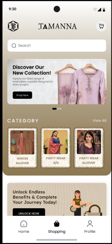
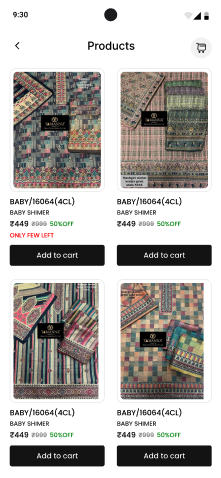

# 📱 Mobile App Development Hub - Kombee

  

---

## Welcome to our Mobile Development Center of Excellence! With over a decade of experience crafting exceptional mobile experiences, we deliver cutting-edge solutions across all major platforms and frameworks.

## 🚀 Our Expertise

We specialize in developing high-performance, secure, and scalable mobile applications using cutting-edge technologies and frameworks. Our solutions cater to diverse industry needs with a focus on delivering exceptional user experiences and adhering to the best practices in software development.

---

### 🌐 **Cross-Platform Development**

- **Flutter** 🚀

  - 🎨 Build beautiful, native apps with a single codebase
  - ⚡ Rapid prototyping using **FlutterFlow**
  - 🔄 Advanced state management solutions:
    - 🎯 **GetX** for simple and reactive state management
    - 🔄 **BLoC (Business Logic Component)** for complex workflows
    - 💉 **Provider** and **Riverpod** for dependency injection
    - 🔄 **MobX** for observable state patterns
    - 📦 **Redux** for predictable state containers
    - 🎯 **Cubit** for lightweight state management
    - ⚡ **RxDart** for reactive programming
    - 🔗 **InheritedWidget** for widget tree state propagation
    - 🌊 **Stream** for asynchronous state handling
    - 💫 **ValueNotifier** for simple value change notifications
  - 🏗️ Robust architectural patterns with **Clean Architecture**
  - 🎨 Enhanced UI/UX design:
    - ✨ Custom animations and micro-interactions
    - 🎨 Compliance with **Material Design 3.0**
    - 📱 Adaptive and responsive layouts
    - ♿ Accessibility-first approach for inclusivity
  - 📱 **Live Apps**:
    - [E-Commerce App on Play Store](https://play.google.com/store/apps/details?id=com.easternts.tamnhabhanu)
    - [E-Commerce App on App Store](https://apps.apple.com/in/app/bhanu/id6449945694)
  - 💻 **Demo Projects**:
    - [Flutter TO-DO Provider](https://github.com/MobileApp-Dev-Kombee/todo_app_provider)
    <!-- - [Flutter Social Media App](https://github.com/flutter/social-demo) -->
  - 🖼️ **UI Screenshots**:

    
    

- **React Native** 📱

  - ⚡ Native performance powered by JavaScript
  - 🔧 Expertise in custom native module and bridge implementations
  - 🔄 State management using **Redux**, **MobX**, or Context API
  - 🔥 Enhanced developer productivity with **hot reloading**
  - 📱 **Live Apps**:
    - [Loyality on Play Store](https://play.google.com/store/apps/details?id=com.birlaopusid.contractorportal&hl=en_IN)
    - [Loyality on App Store](https://apps.apple.com/in/app/birla-opus-id/id6476536889)
  <!-- - 💻 **Demo Projects**:
    - [Food Delivery App](https://github.com/react-native/food-delivery-demo)
    - [Task Management App](https://github.com/react-native/task-manager-demo) -->
  - 🖼️ **UI Screenshots**:

  

  
  
  

    <!-- 
     -->
    
<!-- 
- **Other Cross-Platform Solutions** 🔄
  - ⚡ **Ionic Framework**: Simplified hybrid app development
    - 🌟 **Demo**: [Ionic Fitness Tracker](https://ionic-fitness-demo.com) 💪
  - 🔷 **Xamarin**: .NET-powered mobile solutions
    - 🌟 **Demo**: [Xamarin Business Dashboard](https://xamarin-dashboard-demo.com) 📊
  - 🔵 **Kotlin Multiplatform Mobile (KMM)**: Shared business logic across platforms
    - 🌟 **Demo**: [KMM Chat App](https://kmm-chat-demo.com) 💬
  - 📱 **NativeScript**: Native UI with JavaScript or TypeScript
    - 🌟 **Demo**: [NativeScript Social Media](https://nativescript-social-demo.com) 🤳
  - 🌐 **PhoneGap/Cordova**: Lightweight, web-based apps
    - 🌟 **Demo**: [Cordova Weather App](https://cordova-weather-demo.com) ⛅
  - 📱 **Framework7**: Mobile-first framework for web and hybrid apps
    - 🌟 **Demo**: [Framework7 Task Manager](https://framework7-tasks-demo.com) ✅
  - 🎯 **Quasar Framework**: Vue.js-powered cross-platform apps
    - 🌟 **Demo**: [Quasar Music Player](https://quasar-music-demo.com) 🎵 -->

---

### 📱 **Native Development**

- **iOS Development** 🍎

  - 🎨 Expertise in **SwiftUI** and **UIKit**
  - 💾 Advanced data persistence solutions with **Core Data** and **Realm**
  - 🎮 Graphics and AR solutions using **Metal** and **ARKit**
  - ✨ Enriching user experiences with **App Clips** and **Widgets**
  - 📱 **Live Apps**:
    - [Online Food Shopping on App Store](https://apps.apple.com/nz/app/service-foods/id1429455264)
  <!-- - 💻 **Demo Projects**:
    - [Fitness Tracking App](https://github.com/ios/fitness-demo)
    - [Meditation App](https://github.com/ios/meditation-demo) -->
  - 🖼️ **UI Screenshots**:
  
   

  
  
    
  

    <!-- 
    
     -->

- **Android Development** 🤖
  - 🎨 Modern UI development with **Jetpack Compose**
  - ⚡ Asynchronous programming using **Kotlin Coroutines**
  - 🎨 Comprehensive design adherence with **Material Design 3**
  - 🔧 Custom view components for unique experiences
  - 📱 **Live Apps**:
    - [Online Firm Track on Play Store](https://play.google.com/store/apps/details?id=com.ets.optimavaluepro)

  <!-- - 💻 **Demo Projects**:
    - [Smart Home Control](https://github.com/android/smarthome-demo)
    - [Weather App](https://github.com/android/weather-demo) -->
  - 🖼️ **UI Screenshots**:

 

  
  
  

    <!-- 
     -->

---

## 💡 **Development Process**

Our development process adheres to industry best practices to ensure maintainability, scalability, quality, security and optimal performance in every project. We leverage **Clean Architecture** principles for all applications, enabling modular and testable codebases.

### 🏛️ Key Pillars of Our Process:

1. 📋 **Requirement Analysis & Planning**

   - 🤝 Collaborate with stakeholders to gather detailed requirements
   - 📝 Define user stories and acceptance criteria
   - 🔍 Identify technology stack and frameworks
   - 🔒 Define security requirements and compliance needs

2. 🏗️ **Architecture Design with Clean Architecture**

   - 🔄 Separation of concerns using layered architecture:
     - 🎨 **Presentation Layer**: UI and user interaction
     - 🧠 **Domain Layer**: Core business logic and use cases
     - 💾 **Data Layer**: Data handling, API integrations, and persistence
   - ✨ Ensures flexibility, maintainability, and testability
   - ⚡ Focus on performance optimization and security by design

3. 🔄 **Agile Development & Iteration**

   - 🏃‍♂️ Sprint-based delivery with frequent demos
   - 🔄 Continuous integration and deployment (CI/CD)
   - 👀 Code reviews and static code analysis for quality assurance
   - 🛡️ Regular security audits and vulnerability assessments

4. 🎨 **UI/UX Excellence**

   - 👥 User-centric design with rapid prototyping and testing
   - 📱 Focus on responsiveness, performance, and accessibility
   - ⚡ Optimized for fast loading and smooth interactions

5. 🧪 **Testing & Quality Assurance**

   - ✅ Unit, integration, and UI testing using industry-standard tools
   - ⚡ Performance optimization and regression testing
   - 🔒 VAPT (Vulnerability Assessment and Penetration Testing)
   - 🛡️ Security testing and compliance verification

6. 🚀 **Deployment & Support**
   - 📲 Streamlined deployment to App Store and Google Play
   - 📊 Post-launch monitoring and maintenance
   - 🔄 Continuous updates based on user feedback
   - 🔒 Regular security patches and updates

---

## 🌟 **Why Choose Us?**

- ✅ Proven expertise in delivering robust and scalable applications
- 🔄 End-to-end development from ideation to deployment
- 📈 Commitment to adopting best practices and latest technologies
- 🎯 Tailored solutions for businesses of all sizes and industries
- 🎨 Focus on delivering exceptional user experiences

## 🌐 **Let’s Connect**

We’re excited to collaborate and bring your ideas to life!

- **Website**: [www.kombee.com](https://www.kombee.com)
- **Email**: contact@kombee.com
- **LinkedIn**: [Kombee Technologies](https://in.linkedin.com/company/kombee-global)
- **Twitter**: [@KombeeTech](https://x.com/kombeeglobal)
